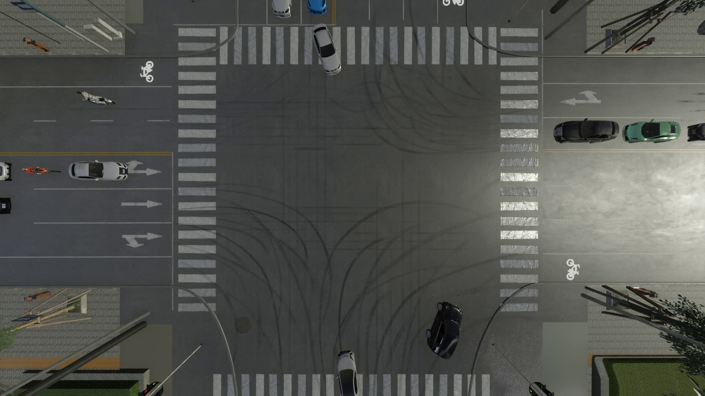
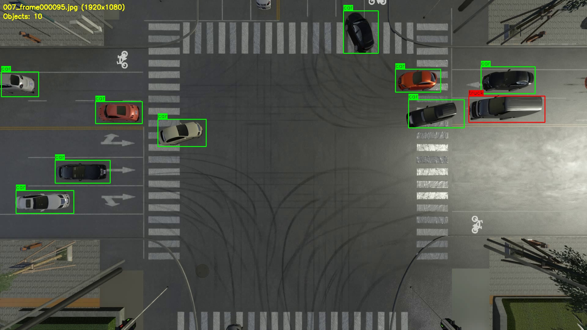
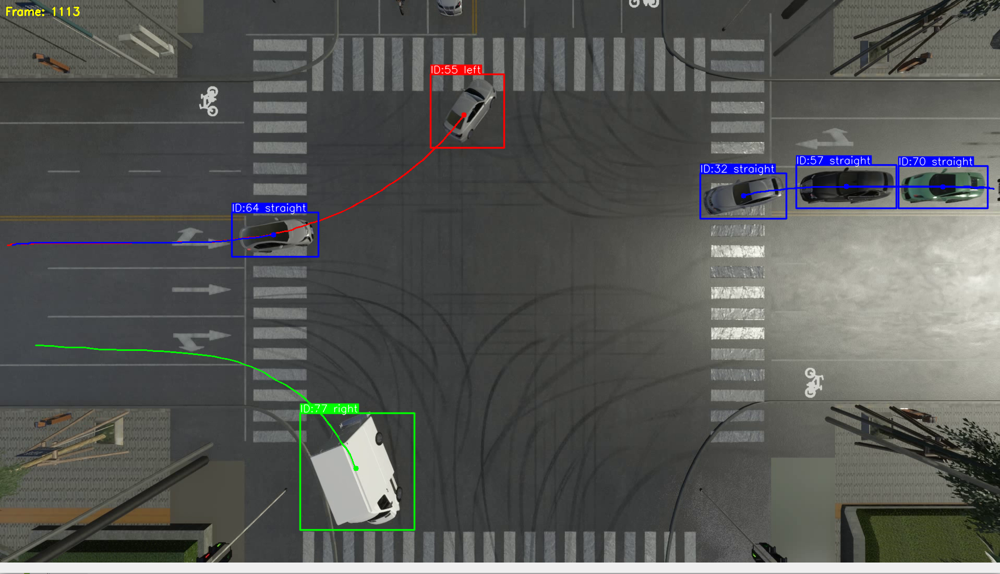
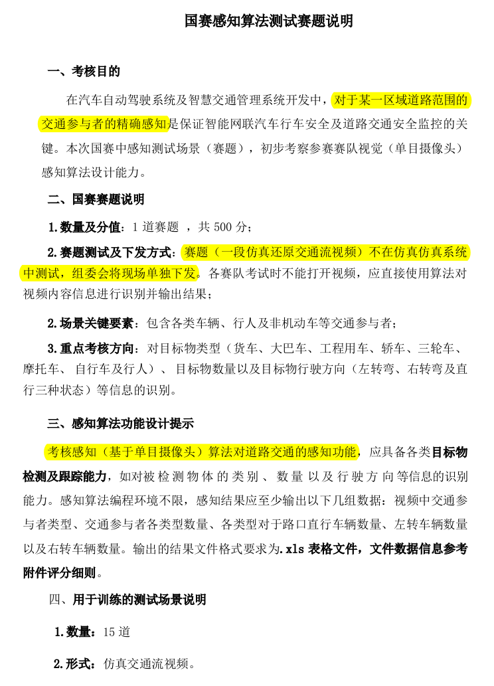

# 车流目标跟踪 CarStreamDetection

如有帮助，求一个星星✨✨✨✨✨✨✨

## 路口车流跟踪及辨向







### 任务



### 程序思路

* 目标检测模型
  * 标注并清洗视频数据，训练yolo目标检测模型
    * DarkLabel tracker2模式处理MOT（多目标跟踪）数据集很有用
    * 总共有18个视频场景，其中有些场景出现了别的场景都没有出现过的类别，只能将其划分入训练集。我保留了2个视频作为验证集/测试集，其余16个视频作为训练集，组织成yolo格式进行训练
    * 对视频每五帧抽帧获取最终数据集。由于各个类别之间差异较大，考虑对含有稀缺类别的视频帧进行逐帧识别，从而增加稀缺类别的训练数量

* 目标跟踪模型

  * 由于yolo自带byteTracking跟踪模型和botsort跟踪模型，我取用了byteTracking模型做目标跟踪。botsort也可以使用。

    * ```python
      results = model.track(
          frame, 
          persist=True, 
          tracker=TRACKER_CONFIG,
          classes=[0, 1, 2, 3, 4, 5, 6, 7]  # 指定要跟踪的类别ID
      )
      ```

    * 将目标跟踪结果传入自己完成的direction_tracker类中，进行滤波、计数和辨向等操作

* DirectionTracker   车流检测器

  * 车流计数
    * 利用目标跟踪模型给视频中的连续目标赋ID，对id进行计数，从而获取各个类别的数量

  * 车流辨向
    * 利用目标初末速度向量的叉乘进行车流辨向
    * 对于行人类，额外定义左转、右转和直行动作，并适应性设计辨向计算方法

### 环境搭建

#### Ubuntu

由于我的Ubuntu环境之前装过yolov12，下面是回忆安装的过程，实际操作只需要能装好yolov11及以上的环境即可

```bash
：conda create -n YOLO-v12
: conda activate YOLO-v12
: git clone https://github.com/ultralytics/ultralytics.git
```

#### Windows

可以参考下面的blog

[windows下安装yolov11](https://blog.csdn.net/FL1623863129/article/details/147778473)

实际比赛环境也是window系统，只需要装好conda环境，安装好yolo ultralytics就可以运行代码

### 代码运行

```bash
CarStreamDetection/ultralytics/ultralytics/code
├── mark.py       #给每张image贴上labels，方便查看gt
├── prepareDataset.py  #将image和labels划分为数据集
├── preprocess.py    #将视频按帧数提取出image和逐帧的labels
├── test.py       #测试yolo目标检测效果
├── tracker.py    #早期tracker备份
├── train.py      #训练yolo目标检测模型
├── CarStreamTracker.py   #进行实时车流检测并生成最终csv表
├── visualize_json.py  #可视化json的gt标签
└── visualize_txt.py #可视化txt的gt标签
```

